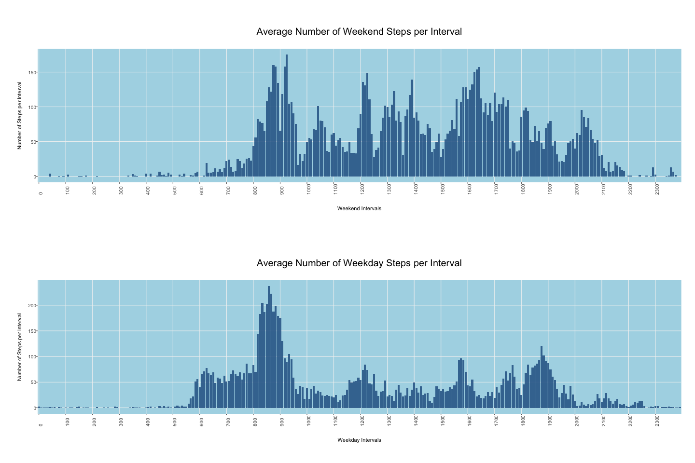

<!---
# Rmarkdown intro
http://rmarkdown.rstudio.com
http://rmarkdown.rstudio.com/authoring_basics.html
--->

## Introduction

It is now possible to collect a large amount of data about personal
movement using activity monitoring devices such as a
[Fitbit](http://www.fitbit.com), [Nike
Fuelband](http://www.nike.com/us/en_us/c/nikeplus-fuelband), or
[Jawbone Up](https://jawbone.com/up). These type of devices are part of
the "quantified self" movement -- a group of enthusiasts who take
measurements about themselves regularly to improve their health, to
find patterns in their behavior, or because they are tech geeks. But
these data remain under-utilized both because the raw data are hard to
obtain and there is a lack of statistical methods and software for
processing and interpreting the data.

This assignment makes use of data from a personal activity monitoring
device. This device collects data at 5 minute intervals through out the
day. The data consists of two months of data from an anonymous
individual collected during the months of October and November, 2012
and include the number of steps taken in 5 minute intervals each day.

## Data

The data for this assignment can be downloaded from the course web
site:

* Dataset: [Activity monitoring data](https://d396qusza40orc.cloudfront.net/repdata%2Fdata%2Factivity.zip) [52K]

The variables included in this dataset are:

* **steps**: Number of steps taking in a 5-minute interval (missing
    values are coded as `NA`)

* **date**: The date on which the measurement was taken in YYYY-MM-DD
    format

* **interval**: Identifier for the 5-minute interval in which
    measurement was taken

The dataset is stored in a comma-separated-value (CSV) file and there
are a total of 17,568 observations in this
dataset.


## 1. Preparing and Reading Data

We will be using ggplot2 to plot data and read.csv to load the data during this exercise.

```{r, echo=TRUE}
#
# Load the libraries we are going to use
# and clean out any left-overs in the $env
rm(list=ls())
dev.off(dev.list())
library(ggplot2)
library(dplyr)
library(grid)
library(gridExtra)
library(data.table)

#
# Read the csv file and transform the date string to a proper date
# and the interval to a factor
steps <- read.csv("activity.csv")
steps$date <- as.Date(steps$date,"%Y-%m-%d")
steps$interval <- as.factor(steps$interval)
```


## 2. Analysing Number of Steps per Day

Looking at the available data there are missing values that are ignored for now. The code below shows 5 categories in which the days can be group into.

Note: Plots do not contain any missing values. They have all been filtered out prior to the plot command.


```{r, echo=TRUE}
#
# Clean out the NAs
steps <- steps[complete.cases(steps),]

#
# Get the number of steps per day and clean up column names
stepsDay <- as.data.frame(tapply(steps$steps,steps$date,sum))
stepsDay$Day <- row.names(stepsDay)
colnames(stepsDay) <- c("Steps","Day")

#
# Add the mean, median and WeekDay values to the data.frame
stepsDay$AvgSteps <- rep(mean(stepsDay$Steps),nrow(stepsDay))
stepsDay$MedSteps <- rep(median(stepsDay$Steps),nrow(stepsDay))
stepsDay$WeekDay <- weekdays(as.Date(stepsDay$Day))

#
# Plot the historgram of the step groups.
par(mar=c(10,10,10,10))
hist(stepsDay$Steps, 
     xlab = "Total Number of Steps in Groups
     Example: 5 days with less than 5000 steps", 
     ylab = "Days with Step Ranges", 
     main = "Number of Steps per Day in Groups",
     col = "lightblue")
```


```{r, echo=TRUE}
#
# Plot it on the X axis, dont plot legend and turn the x-labels
g <- ggplot(stepsDay, aes(x=Day, y=Steps, fill = 20))
g + geom_bar(stat = "Identity", alpha = 0.9) +
    theme(axis.text.x = element_text(angle = 90, hjust = 0)) +
    theme(panel.background = element_rect(fill = "lightblue")) +
    theme(strip.background = element_rect(fill = "lightblue")) +
    theme(panel.grid.minor = element_blank()) +
    theme(panel.grid.major = element_line(colour = "grey95")) +
    theme(plot.margin=unit(c(2,1,1.5,1.2),"cm")) +
    scale_y_continuous(labels = scales::comma) +
    theme(legend.position="none") +
    theme(axis.text.x = element_text(size=10,margin = margin(0,0,20,0))) +
    ylab("Number of Recorded Step") + 
    theme(axis.text.y = element_text(size=10,margin = margin(0,0,0,10))) +
    ggtitle("Number of Steps Recorded per Day") +
    theme(plot.title = element_text(size = 20,margin = margin(0,0,30,0)))
```


## 3. Mean and Median Number of Steps

Rmarkdown displays the text below fine ( Mean = 10,766.19, Median = 10,765). The Github Readme does however not understand this.

The average number of steps taken per day is `r format(mean(stepsDay$Steps), digits=7, decimal.mark=".", big.mark=",",small.mark="", , small.interval=2)`. This does not factor in the weekday just an overall average of available data.

The median for the steps is `r format(median(stepsDay$Steps), digits=5, big.mark=",",small.mark="")`. This means that half of the days had less steps than the median and the other half had more steps.


## 4. Average Number of Steps per Day over Time

To plot the average number of steps per day over time, we add that value and the median value to the stepsDay data frame. We do not need the median value now but adding it in case we need it later. Lets add the weekday in there as well.


```{r, echo=TRUE}
#
# Plot that time series 
g <- ggplot(stepsDay, aes(x=Day, y=AvgSteps, fill = 20))
g + geom_bar(stat = "Identity", alpha = 0.9) +
    theme(axis.text.x = element_text(angle = 90, hjust = 0)) +
    theme(panel.background = element_rect(fill = "lightblue")) +
    theme(strip.background = element_rect(fill = "lightblue")) +
    theme(panel.grid.minor = element_blank()) +
    theme(panel.grid.major = element_line(colour = "grey95")) +
    theme(plot.margin=unit(c(2,1,1.5,1.2),"cm")) +
    scale_y_continuous(labels = scales::comma) +
    theme(legend.position="none") +
    xlab("Steps per Day") +
    theme(axis.text.x = element_text(size=10,margin = margin(0,0,20,0))) +
    ylab("Average Number of Steps") + 
    theme(axis.text.y = element_text(size=10,margin = margin(0,0,0,10))) +
    ggtitle("Average Number of Steps per Day") +
    theme(plot.title = element_text(size = 20,margin = margin(0,0,30,0)))
```


## 5. The 5-minute interval that, on average, contains the maximum number of steps

If we take the average of the steps in each interval across the entire data set we see that the interval in between ~800 and ~900 in the morning seems a likely candidate for the most active period during the day.


```{r, echo=TRUE}
#
# Lets grab the average values for the intervals first
# and fix the column names
stepsAvgInt <- as.data.frame(tapply(steps$steps,steps$interval, mean))
stepsAvgInt$Interval <- row.names(stepsAvgInt)
colnames(stepsAvgInt) <- c("Steps","Interval")

#
# Ensure geom_bar does not try and sort the x Axis
stepsAvgInt$Interval <- factor(stepsAvgInt$Interval, levels = stepsAvgInt$Interval)

g <- ggplot(stepsAvgInt, aes(x=Interval, y=Steps, fill = 20))
g + geom_bar(stat = "Identity", alpha = 0.9) + geom_hline(yintercept=100, col = "red") +
    theme(axis.text.x = element_text(angle = 90, hjust = 0)) +
    theme(panel.background = element_rect(fill = "lightblue")) +
    theme(strip.background = element_rect(fill = "lightblue")) +
    theme(panel.grid.minor = element_blank()) +
    theme(panel.grid.major = element_line(colour = "grey95")) +
    theme(plot.margin=unit(c(2,1,1.5,1.2),"cm")) +
    scale_y_continuous(labels = scales::comma) +
    theme(legend.position="none") +
    xlab("Daily Intervals") +
    #
    # ticks only at the full hour
    scale_x_discrete(breaks=seq(0,2355,100)) +
    theme(axis.text.x = element_text(size=10,margin = margin(0,0,20,0))) +
    ylab("Number of Steps per Interval") + 
    theme(axis.text.y = element_text(size=10,margin = margin(0,0,0,10))) +
    ggtitle("Average Number of Steps per Interval") +
    theme(plot.title = element_text(size = 20,margin = margin(0,0,30,0)))
```


Looking closer at the data in between 0800 and 0900 we see that there are values below 100 steps so I should take a deeper look into that later to get a better specification of the interval.


```{r, echo = TRUE}
#
# visual inspection gives us the time interval between 0800 and 0900 
# in the morning seems to be the most active ones.
stepsMaxInt <- stepsAvgInt[with(stepsAvgInt, stepsAvgInt$Interval %in% seq(800,855,5)),]

#
# lets plot that
g <- ggplot(stepsMaxInt, aes(x=Interval, y=Steps, fill = 20))
g + geom_bar(stat = "Identity", alpha = 0.9) + geom_hline(yintercept=100, col = "red") +
    theme(axis.text.x = element_text(angle = 90, hjust = 0)) +
    #theme(axis.ticks.x = element_blank()) +
    #theme(axis.ticks.length = 12) +
    theme(panel.background = element_rect(fill = "lightblue")) +
    theme(strip.background = element_rect(fill = "lightblue")) +
    theme(panel.grid.minor = element_blank()) +
    theme(panel.grid.major = element_line(colour = "grey95")) +
    theme(plot.margin=unit(c(2,1,1.5,1.2),"cm")) +
    scale_y_continuous(labels = scales::comma) +
    theme(legend.position="none") +
    xlab("Between 800 and 855") +
    #
    # ticks only at the full hour
    theme(axis.text.x = element_text(size=10,margin = margin(0,0,20,0))) +
    ylab("Number of Steps per Interval") + 
    theme(axis.text.y = element_text(size=10,margin = margin(0,0,0,10))) +
    ggtitle("Steps per Interval between 800 and 855") +
    theme(plot.title = element_text(size = 20,margin = margin(0,0,30,0)))

```


We learn that simply taking the daily average across the entire data set will be a bad strategy for imputing mussing data. We also see that depening on what time during the day and also the day of week.

Let's investigate that in more detail and see if we can learn more for implementing an impute strategy


```{r, echo=TRUE, fig.width=15, fig.height=15}
#
# Lets split the stuff out per day of week

#
# Average steps per weekday, day
stepsAvgWday <- arrange(stepsDay %>% group_by(WeekDay,Day) %>% summarise(mean(Steps)),WeekDay,Day)
colnames(stepsAvgWday) <- c("WeekDay","Day","Steps")
#

g <- ggplot(stepsAvgWday, aes(x=Day, y=Steps))
p1 <- g + geom_bar(stat = "Identity", aes(fill=WeekDay)) +
    facet_grid(.~WeekDay) 

#
# Compare this with the number of steps per interval and day
steps$WeekDay <- weekdays(as.Date(steps$date))
stepsAvgDayInt <- arrange(steps %>% group_by(WeekDay,interval) %>% summarise(mean(steps)),WeekDay,interval)
colnames(stepsAvgDayInt) <- c("WeekDay","Interval","Steps")

g <- ggplot(stepsAvgDayInt, aes(x=Interval, y=Steps))
p2 <- g + geom_bar(stat = "Identity", aes(fill=WeekDay)) +
    facet_grid(.~WeekDay) 

grid.arrange(p1,p2, nrow = 2, ncol = 1, top = "Daily Steps Profile vs Interval Steps Profile")

```


New information from these plots are that Fridays and Thursdays have higher average number of steps. We also see that during the night we have considerably less steps and may need to consider assigning a very low value between 12:00am and 06:00am for missing values.


## 6. Code to describe and show a strategy for imputing missing data

Note: This paragraph answers question 7 as well.

Based on what we have previously learned our strategy for imputing missing values is described by the sequence below.

1. Create a data frame with average values per weekday and interval
2. Find the missing values in the original dataset
3. Establish the interval and weekday of the missing value
4. Look it up in the data frame with the weekday and interval averages.
5. Assign the average to the missing value.

In the previous code we did already create that 1) data frame (stepsAvgIntDay) and we can re-use this one to lookup those values. That "reference frame" contains all 288 intervals for 7 days. If we check the lenght of it it has 288 * 7 = 2,016 observations. This means that we have average values for all possible intervals that could potentially be missing.

Reading in the data again placing it in another data frame to keep all other information intact while we attempt and replace those missing values.


```{r, echo=TRUE}
stepsOrig <- read.csv("activity.csv")
stepsOrig$date <- as.Date(stepsOrig$date,"%Y-%m-%d")
stepsOrig$interval <- as.factor(stepsOrig$interval)
stepsOrig$WeekDay <- weekdays(as.Date(stepsOrig$date))
colnames(stepsOrig) <- c("Steps","Day","Interval","WeekDay")
```


How many missing values do we have? Executing mean(is.na(stepsOrig[1])) tells us roughly 13%. The Knitrcode code tells us `r format(100*mean(is.na(stepsOrig[1])), digits=4, decimal.mark=".", big.mark=",",small.mark="" , small.interval=2)`% of the observations have missing values. This is above 5% and can be considered as statistically significant not to be ignored.


```{r, echo=TRUE}

#
# Lookup and replace the missing values. If you know the tapply,sapply, split version of this I would be
# more then welcome to be educated. I just could not figure that out. :-/
for (i in 1:nrow(stepsOrig)) {

    row = stepsOrig[i,]
    ISNA <- FALSE
    
    if (is.na(stepsOrig[i,1])) {
        ISNA <- TRUE
        lookWeekDay <- row[1,4]
        lookInterval <- row[1,3]
        stepsOrig[i,1] <- as.integer(round(filter(stepsAvgDayInt, WeekDay == lookWeekDay & Interval == lookInterval)[,3]))
    }
    
}

```


Plotting the new timeseries the total number of steps per day a lot more data emerges. The plots also answers question No.7 illustrating the imputed data.


```{r, echo = TRUE, fig.width=15, fig.height=15}
#
# Average the values per day
stepsOrigAvg <- as.data.frame(tapply(stepsOrig$Steps, stepsOrig$Day, sum))
stepsOrigAvg$Day <- row.names(stepsOrigAvg)
colnames(stepsOrigAvg) <- c("Steps","Day")


#
# Plot that time series 
g <- ggplot(stepsOrigAvg, aes(x=Day, y=Steps, fill = 20))
p1 <- g + geom_bar(stat = "Identity", alpha = 0.9) +
    theme(axis.text.x = element_text(angle = 90, hjust = 0)) +
    theme(panel.background = element_rect(fill = "lightblue")) +
    theme(strip.background = element_rect(fill = "lightblue")) +
    theme(panel.grid.minor = element_blank()) +
    theme(panel.grid.major = element_line(colour = "grey95")) +
    theme(plot.margin=unit(c(2,1,1.5,1.2),"cm")) +
    scale_y_continuous(labels = scales::comma) +
    theme(legend.position="none") +
    xlab("Steps per Day") +
    theme(axis.text.x = element_text(size=10,margin = margin(0,0,20,0))) +
    ylab("Average Number of Steps") + 
    theme(axis.text.y = element_text(size=10,margin = margin(0,0,0,10))) +
    ggtitle("Average Number of Steps per Day Adjusted for Missing Values") +
    theme(plot.title = element_text(size = 20,margin = margin(0,0,30,0)))

#
# Add the comparison as a service for the reader
g <- ggplot(stepsDay, aes(x=Day, y=Steps, fill = 20))
p2 <- g + geom_bar(stat = "Identity", alpha = 0.9) +
    theme(axis.text.x = element_text(angle = 90, hjust = 0)) +
    theme(panel.background = element_rect(fill = "lightgrey")) +
    theme(strip.background = element_rect(fill = "lightgrey")) +
    theme(panel.grid.minor = element_blank()) +
    theme(panel.grid.major = element_line(colour = "grey95")) +
    theme(plot.margin=unit(c(2,1,1.5,1.2),"cm")) +
    scale_y_continuous(labels = scales::comma) +
    theme(legend.position="none") +
    xlab("Steps per Day") +
    theme(axis.text.x = element_text(size=10,margin = margin(0,0,20,0))) +
    ylab("Average Number of Steps") + 
    theme(axis.text.y = element_text(size=10,margin = margin(0,0,0,10))) +
    ggtitle("Average Number of Steps per Day without Adjustment for Missing Values") +
    theme(plot.title = element_text(size = 20,margin = margin(0,0,30,0)))

grid.arrange(p1,p2, nrow = 2, ncol = 1)
```


## 8. Panel plot comparing the average number of steps taken per 5-minute interval across weekdays and weekends

Using the adjusted data set and adding the weekday and plotting one chart per Saturday and Sundday and one for the days Monday through Friday.


```{r, echo=TRUE, fig.width=15, fig.height=25}

stepsOrigAvg$WeekDay <- weekdays(as.Date(stepsOrigAvg$Day))
stepsOrigWEDays <- filter(data.table(stepsOrigAvg), WeekDay %in% c("Saturday","Sunday"))
stepsOrigWEDays <- as.data.frame(tapply(stepsOrigWEDays$Steps,stepsOrigWEDays$WeekDay, mean))
stepsOrigWEDays$Day <- row.names(stepsOrigWEDays)
colnames(stepsOrigWEDays) <- c("Steps","Day")

stepsOrigWKDays <- filter(data.table(stepsOrigAvg), WeekDay %in% c("Monday","Tuesday","Wednesday","Thursday","Friday"))
stepsOrigWKDays <- as.data.frame(tapply(stepsOrigWKDays$Steps,stepsOrigWKDays$WeekDay, mean))
stepsOrigWKDays$Day <- row.names(stepsOrigWKDays)
colnames(stepsOrigWKDays) <- c("Steps","Day")

g <- ggplot(stepsOrigWEDays, aes(x=Day, y=Steps))
p1 <- g + geom_bar(stat = "Identity", aes(fill=Day)) +
    geom_text(aes(label=paste(round(Steps,0)," Steps")), position = position_dodge(width=0.9), vjust=-.5, color="black") +
    theme(axis.text.x = element_text(angle = 90, hjust = 0)) +
    theme(panel.background = element_rect(fill = "lightgrey")) +
    theme(strip.background = element_rect(fill = "lightgrey")) +
    theme(panel.grid.minor = element_blank()) +
    theme(panel.grid.major = element_line(colour = "grey95")) +
    theme(plot.margin=unit(c(2,1,1.5,1.2),"cm")) +
    scale_y_continuous(labels = scales::comma) +
    theme(legend.position="none") +
    xlab("Steps per Day") +
    theme(axis.text.x = element_text(size=10,margin = margin(0,0,20,0))) +
    ylab("Average Number of Steps") + 
    theme(axis.text.y = element_text(size=10,margin = margin(0,0,0,10))) +
    ggtitle("Average Number of Steps for Weekend Days Adjustmed for Missing Values") +
    theme(plot.title = element_text(size = 20,margin = margin(0,0,30,0)))

g <- ggplot(stepsOrigWKDays, aes(x=Day, y=Steps))
p2 <- g + geom_bar(stat = "Identity", aes(fill=Day)) +
    geom_text(aes(label=paste(round(Steps,0)," Steps")), position = position_dodge(width=0.9), vjust=-.5, color="black") +
    theme(axis.text.x = element_text(angle = 90, hjust = 0)) +
    theme(panel.background = element_rect(fill = "lightgrey")) +
    theme(strip.background = element_rect(fill = "lightgrey")) +
    theme(panel.grid.minor = element_blank()) +
    theme(panel.grid.major = element_line(colour = "grey95")) +
    theme(plot.margin=unit(c(2,1,1.5,1.2),"cm")) +
    scale_y_continuous(labels = scales::comma) +
    theme(legend.position="none") +
    xlab("Steps per Day") +
    theme(axis.text.x = element_text(size=10,margin = margin(0,0,20,0))) +
    ylab("Average Number of Steps") + 
    theme(axis.text.y = element_text(size=10,margin = margin(0,0,0,10))) +
    ggtitle("Average Number of Steps for Weekdays Adjustmed for Missing Values") +
    theme(plot.title = element_text(size = 20,margin = margin(0,0,30,0)))

grid.arrange(p1,p2, nrow = 2, ncol = 1)
```


Plotting the interval pattern for weekend and weekdays we see a distinct difference during the days.


```{r, echo=TRUE, fig.width=15, fig.height=15}
#
# Add the final plot comparing WE and WK interval patterns
#
stepsOrigIntWE <- filter(data.table(stepsOrig), WeekDay %in% c("Saturday","Sunday"))
stepsOrigIntWEAvg <- as.data.frame(tapply(stepsOrigIntWE$Steps,stepsOrigIntWE$Interval,mean))
stepsOrigIntWEAvg$Interval <- row.names(stepsOrigIntWEAvg)
colnames(stepsOrigIntWEAvg) <- c("Steps","Interval")
# Ensure geom_bar does not try and sort the x Axis
stepsOrigIntWEAvg$Interval <- factor(stepsOrigIntWEAvg$Interval, levels = stepsAvgInt$Interval)


stepsOrigIntWK <- filter(data.table(stepsOrig), WeekDay %in% c("Monday","Tuesday","Wednesday","Thursday","Friday"))
stepsOrigIntWKAvg <- as.data.frame(tapply(stepsOrigIntWK$Steps,stepsOrigIntWK$Interval,mean))
stepsOrigIntWKAvg$Interval <- row.names(stepsOrigIntWKAvg)
colnames(stepsOrigIntWKAvg) <- c("Steps","Interval")
# Ensure geom_bar does not try and sort the x Axis
stepsOrigIntWKAvg$Interval <- factor(stepsOrigIntWKAvg$Interval, levels = stepsAvgInt$Interval)

g <- ggplot(stepsOrigIntWEAvg, aes(x=Interval, y=Steps, fill = 20))
p1 <- g + geom_bar(stat = "Identity", alpha = 0.9) +
    theme(axis.text.x = element_text(angle = 90, hjust = 0)) +
    theme(panel.background = element_rect(fill = "lightblue")) +
    theme(strip.background = element_rect(fill = "lightblue")) +
    theme(panel.grid.minor = element_blank()) +
    theme(panel.grid.major = element_line(colour = "grey95")) +
    theme(plot.margin=unit(c(2,1,1.5,1.2),"cm")) +
    scale_y_continuous(labels = scales::comma) +
    theme(legend.position="none") +
    xlab("Weekend Intervals") +
    #
    # ticks only at the full hour
    scale_x_discrete(breaks=seq(0,2355,100)) +
    theme(axis.text.x = element_text(size=10,margin = margin(0,0,20,0))) +
    ylab("Number of Steps per Interval") + 
    theme(axis.text.y = element_text(size=10,margin = margin(0,0,0,10))) +
    ggtitle("Average Number of Weekend Steps per Interval") +
    theme(plot.title = element_text(size = 20,margin = margin(0,0,30,0)))

g <- ggplot(stepsOrigIntWKAvg, aes(x=Interval, y=Steps, fill = 20))
p2 <- g + geom_bar(stat = "Identity", alpha = 0.9) +
    theme(axis.text.x = element_text(angle = 90, hjust = 0)) +
    theme(panel.background = element_rect(fill = "lightblue")) +
    theme(strip.background = element_rect(fill = "lightblue")) +
    theme(panel.grid.minor = element_blank()) +
    theme(panel.grid.major = element_line(colour = "grey95")) +
    theme(plot.margin=unit(c(2,1,1.5,1.2),"cm")) +
    scale_y_continuous(labels = scales::comma) +
    theme(legend.position="none") +
    xlab("Weekday Intervals") +
    #
    # ticks only at the full hour
    scale_x_discrete(breaks=seq(0,2355,100)) +
    theme(axis.text.x = element_text(size=10,margin = margin(0,0,20,0))) +
    ylab("Number of Steps per Interval") + 
    theme(axis.text.y = element_text(size=10,margin = margin(0,0,0,10))) +
    ggtitle("Average Number of Weekday Steps per Interval") +
    theme(plot.title = element_text(size = 20,margin = margin(0,0,30,0)))

grid.arrange(p1,p2, nrow = 2, ncol = 1)
```

